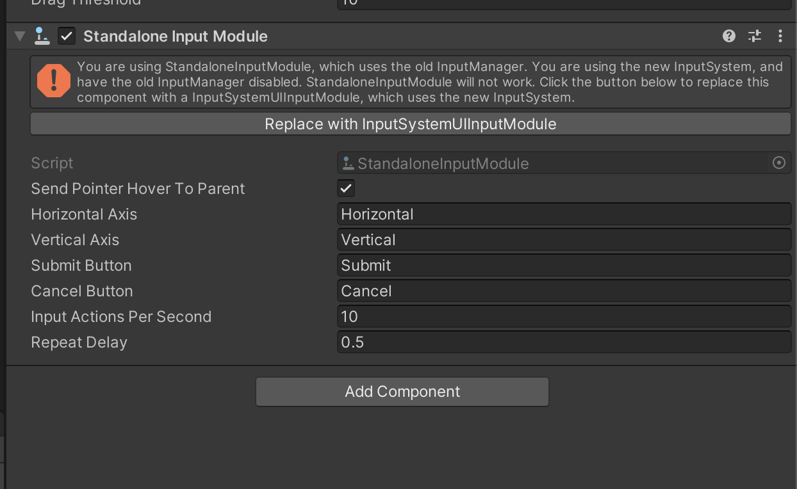
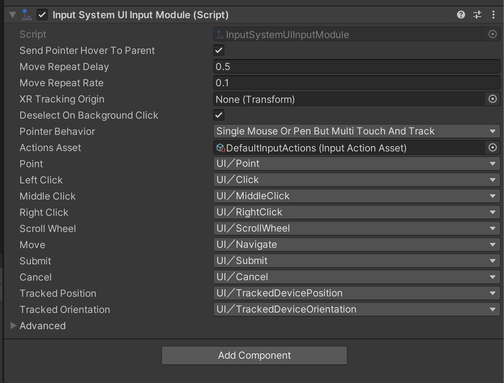

# Frequently Asked Questions

### Why can't I see the App UI components in the UI Builder components library?

By default, the UI Builder components library only shows the components that are available outside of
the `UnityEngine.*` namespace. If you want to see the App UI components, you need to enable
the **Developer Mode** of the Unity Editor.

> [!NOTE]
> Before 0.3.0, the App UI components were in the `UnityEngine` namespace, so they were
> not visible in the UI Builder components library. Starting from 0.3.0, the App UI components
> are in the `Unity.AppUI` namespace, and you should not have this issue anymore.

To enable the **Developer Mode** of the Unity Editor, open the **About Unity** window and
while focusing on the **About Unity** window, type `internal` on your keyboard. This will
prompt you to restart the Unity Editor. After restarting the Unity Editor, you will be able to
see the App UI components in the UI Builder components library.

### In UI Builder, why App UI components look unstyled/broken?

The UI Builder use a default theme to display the visual tree inside the Preview panel.
This theme is useful for Editor windows development but it doesn't match the App UI theme.

To use the App UI theme in the UI Builder, choose the **App UI** theme in the **Theme** dropdown,
or a more specific theme like **App UI Dark - Medium** or **App UI Light - Medium**.

### Does App UI support EditorWindow (Edit Mode)?

Yes, App UI supports EditorWindow. You can use App UI components in your Editor windows.

To make it work correctly, do not forget to load the right theme inside you window.

```cs
class MyWindow : EditorWindow
{
    void CreateGUI()
    {
        const string defaultTheme = "Packages/com.unity.dt.app-ui/PackageResources/Styles/Themes/App UI.tss";
        rootVisualElement.styleSheets.Add(AssetDatabase.LoadAssetAtPath<ThemeStyleSheet>(defaultTheme));
        rootVisualElement.AddToClassList("unity-editor"); // Enable Editor related styles
    }
}
```

You can also specify the theme stylesheet inside you UXML file directly.

```xml
<Style src="project:/Packages/com.unity.dt.app-ui/PackageResources/Styles/Themes/App UI.tss"/>
```

### I see an error message "Exception: Attempting to use an invalid operation handle" when I go in Play Mode

This error message is caused by an invalid load of Addressables content. 
App UI uses Addressables via the Localization Unity Package only for the localization of text elements.
To avoid this message, you have 2 options:
- Go to **Edit > Project Settings > Localization** and check the **Initialize Synchronously** option.
- Upgrade the Localization package version used by your project (1.4.3 for example seems to have this issue fixed).

### Is the New Input System supported?

Yes, the New Input System is supported. You can use the App UI components with the New Input System.

- To install the New Input System, go to **Window > Package Manager** and install the **Input System** package.
- In your scene, you will need to add the **Input System UI Module** component to your Event System.
  You can create a new Event System by going to **GameObject > UI > Event System**.
- You should see a message in the Inspector view asking you to update the Event System.
  Click on the **Replace with InputSystemUIInputModule** button.
  
- You can now use the App UI components with the New Input System.
  

### Why does the Editor maximize docked windows when I try to zoom into an App UI [Canvas](xref:Unity.AppUI.UI.Canvas) component using an Apple trackpad?

This is a known issue with the Unity Editor on macOS. 
To avoid this issue temporarily, you can disable the **Zoom gesture** in the **Trackpad** settings of your Mac. By 
disabling the gesture, you will still be able to zoom in and out in the Canvas component, but the Editor will not 
handle them anymore.