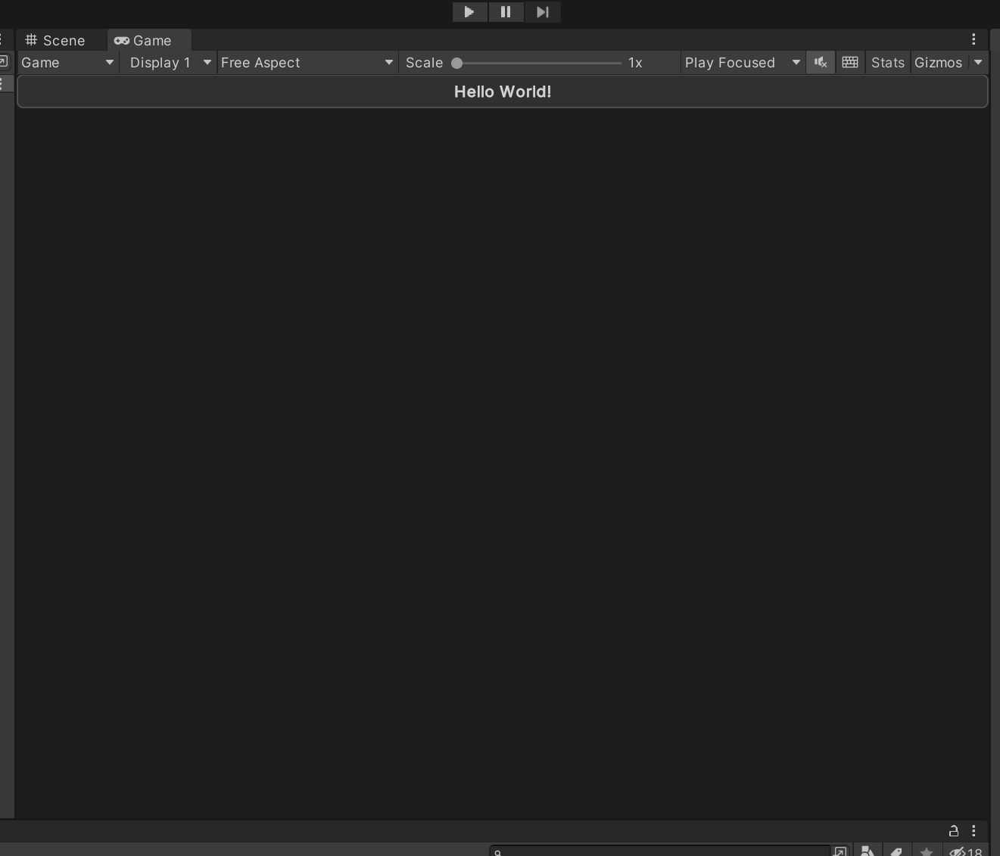

# Using App UI

Once you have installed App UI Unity Package, you can start using it in your Unity projects.

## App UI Panel - The root context for all App UI components

In order for App UI components to be displayed correctly, they must be fed with an [`ApplicationContext`](xref:Unity.AppUI.Core.ApplicationContext) object. 
This object is defines some properties that can affect the component's look and feel, such as the current theme, the current language, and the current screen size. 
This [`ApplicationContext`](xref:Unity.AppUI.Core.ApplicationContext) object is provided by a [`ContextProvider`](xref:Unity.AppUI.UI.ContextProvider) component.

To know more about Context management, see the [Context documentation page](xref:contexts).

The application will also need to have a special layering system to display UI elements on top of the app's content, 
such as a dialog box or a popup menu.

The [`Panel`](xref:Unity.AppUI.UI.Panel) component is a special [`ContextProvider`](xref:Unity.AppUI.UI.ContextProvider) 
that provides a default [`ApplicationContext`](xref:Unity.AppUI.Core.ApplicationContext) object,
based on the current system information, and a layering system to handle popups, notifications, and tooltips.

It is highly recommended to use the [`Panel`](xref:Unity.AppUI.UI.Panel) component as the root component of your application.

Here is an example of usage inside your [`UI Document`](xref:UnityEngine.UIElements.UIDocument):

```xml
<UXML xmlns="UnityEngine.UIElements" xmlns:appui="Unity.AppUI.UI">
    <appui:Panel>
        <!-- Your UI elements -->
    </appui:Panel>
</UXML>
```

## App UI Components

App UI components are defined as [`VisualElement`](xref:UnityEngine.UIElements.VisualElement) in [UI Toolkit](xref:UIElements).
You can find them in the `Unity.AppUI.UI` namespace. 

If you are working directly by editing UXML files, we recommend to define the `appui` namespace inside.
You can also update the UXML Schema definition to get autocompletion in your IDE by selecting **Assets > Update UXML Schema** in the Editor.

Here is an example of usage inside your [`UI Document`](xref:UnityEngine.UIElements.UIDocument):

```xml
<UXML xmlns="UnityEngine.UIElements" xmlns:appui="Unity.AppUI.UI">
    <appui:Panel>
        <appui:Button title="Hello World!" />
    </appui:Panel>
</UXML>
```

<p align="center">
  
</p>
